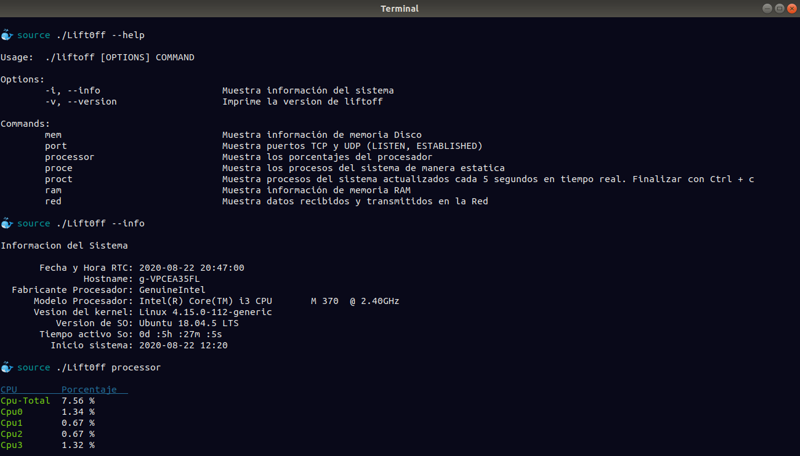
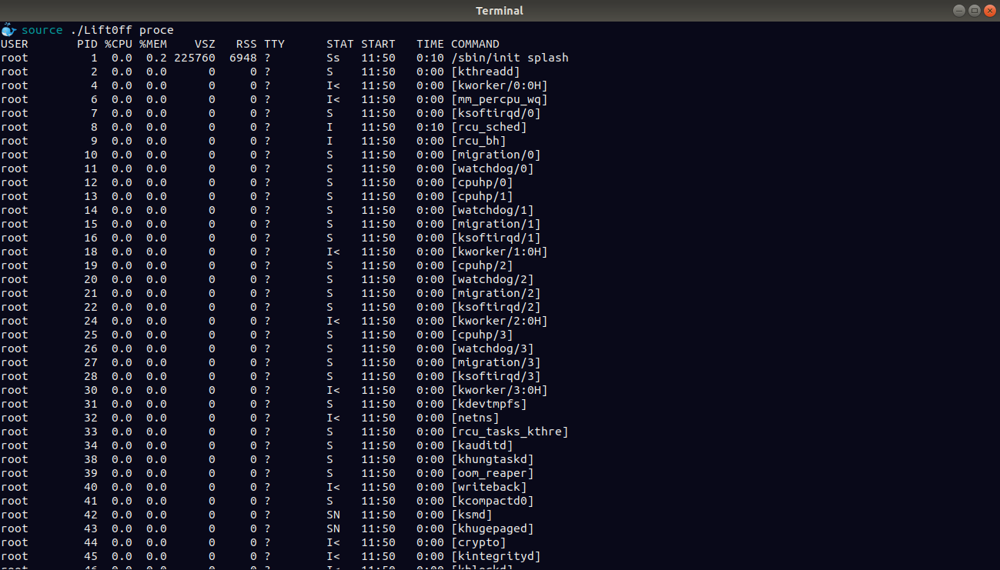
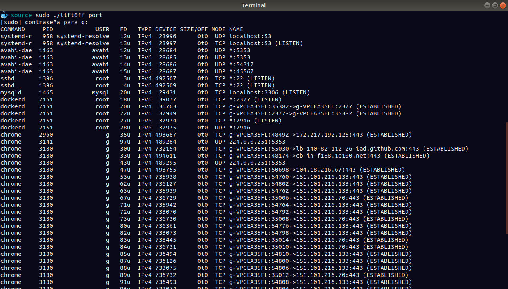

<p align="center"> 

</p>
<p align="center">
    <a href="https://img.shields.io/badge/-Linux-grey?logo=linux" alt="Linux">
        </a>
    <a href="https://img.shields.io/badge/Bash-v4.4%5E-green?logo=GNU%20bash" alt="Bash">
        </a>
    <a href="https://img.shields.io/badge/Go-v1.14.6-blue" alt="Go">
        </a>
    <a href="https://img.shields.io/badge/version-v1.0.0-informational" alt="Version">
        </a>
</p>

# Lift0ff

**Lift0ff** es una aplicación binaria que permite conocer métricas del sistema como: memoria ram, memoria disco, procesos, puertos, datos de red, porcentajes de cpu e información en general del sistema operativo Linux.


## Screenshots

Ejecución con banderas `--help`, `--info` y `processor`


Ejecución con bandera `proce`


Ejecución con bandera `port`



## Dependencias
Las dependencias con las que cuenta Lift0ff son:
- [x] Golang, se provo con la versión ***go1.14.6 linux/amd64***. Puede descargar **[Go](https://golang.org/dl/)** 
- [x] bash (v4.4 o posterior), se provo en la versión 4.4.20 y no hubo inconvenientes. Verificar versión: ***bash --version***
- [x] Tener instalado binario disk free(df), necesario para mostrar los datos de memoria disco. Verificar binario instalado: ***which df***
- [x] **who**, necesario para mostrar datos de inicio de Pc. Verificar binario instalado: ***which who*** 
- [x] Table of processes **top**, necesario para mostrar los procesos activos Pc. Verificar binario instalado: ***which top*** 
- [x] Process Status **ps**, necesario para mostrar los procesos activos Pc. Verificar binario instalado: ***which ps***
- [x] List Of Open File **lsof**, necesario para mostrar los puertos de Pc. Verificar binario instalado: ***which lsof***
- [x] Directorio **/proc** para recopilar datos
- [x] Instalar paquetes de Go para mostrar tablas: ***go get github.com/rodaine/table*** y ***go get github.com/fatih/color***
- [x] Instalar paquetes de Go para mostrar porcentaje de cpu: ***go get github.com/shirou/gopsutil/cpu***. COnsultar al repositorio: [gopsutil](https://github.com/shirou/gopsutil) 
 

## Instalación y Ejecución

Instale Go si aún no lo ha hecho.
Descargue el repositorio y en el directorio source ejecute:

```go build Lift0ff.go```

### Ejecución aplicación:

```./liftoff [OPTIONS] COMMAND```
